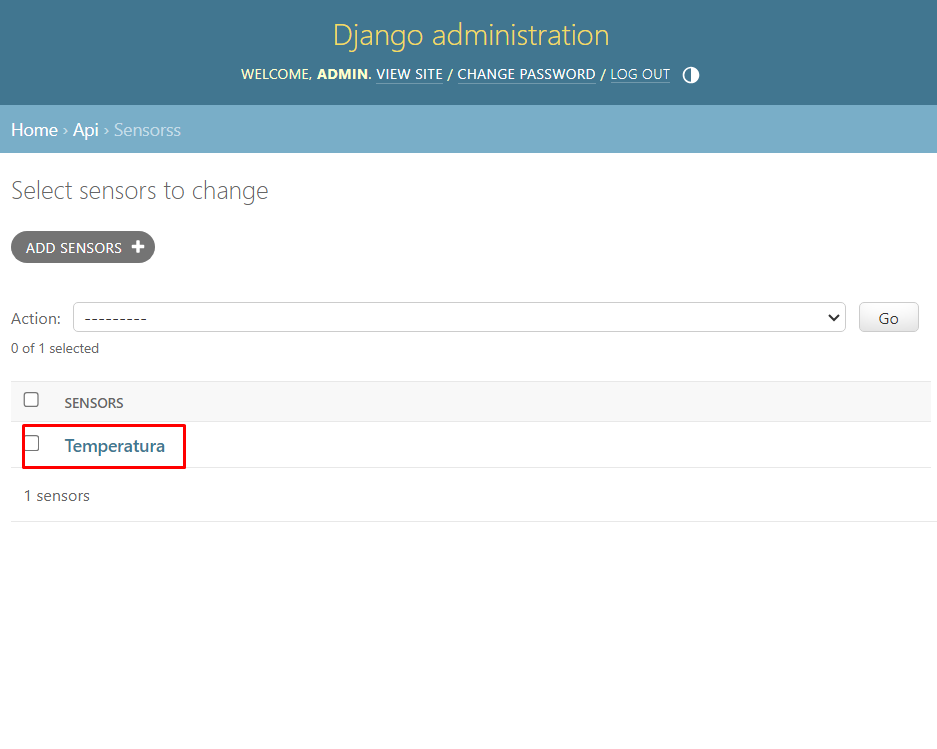

<p align="center">
    
</p>

<h3 align="center">Gerenciamento de Iot </h3>

<p align="center">
  GCC129 - Sistemas Distribuídos - Prof. André de Lima Salgado
</p>
    
## Membros do grupo:
- DIEGO DE SOUZA MARQUES **202111037** *(diego.marques1@estudante.ufla.br)*
- RICARDO AUGUSTO SANTOS **202110173** *(ricardo.santos3@estudante.ufla.br)*
- THIAGO HENRIQUE DOS REIS MAGALHÃES **202110174** *(thiago.magalhaes3@estudante.ufla.br)*

## Descrição do projeto:
Este trabalho prático tem como objetivo aplicar os conceitos e tecnologias estudados na disciplina GCC129 - Sistemas Distribuídos. Foi desenvolvido uma aplicação para gerenciamento de plantas com a utilização de sensores, a ideia é unificar os dados coletados pelos sensores e disponibilizar para o usuário através de uma interface. A aplicação foi desenvolvida utilizando a linguagem de programação Python.

---
## Roadpmap:
1. [Introdução](#1-introdução)
    1. [Cria uma máquina de desenvolvimento virtual](#11-cria-uma-máquina-de-desenvolvimento-virtual)
    2. [Instalações necessárias no ambiente virtual](#12-instalações-necessárias-no-ambiente-virtual)
2. [Arquitetura do Sistema](#2-arquitetura-do-sistema)
3. [Criando o projeto](#3-criando-o-projeto)
4. [Aplicação migrations](#4-aplicação-migrations)
5. [Introdução ao sistema de administração](#5-introdução-ao-sistema-de-administração)
6. [Criando a aplicação](#6-criando-a-aplicação)
7. [Registrando a aplicação](#7-registrando-a-aplicação)
    1. [Adicioando url da aplicação](#71-adicioando-url-da-aplicação)
    2. [Criando urls da aplicação](#72-criando-urls-da-aplicação)
8. [Criando o model](#8-criando-o-model)
9. [Adicionando o model no sistema de administração](#9-adicionando-o-model-no-sistema-de-administração)
    1. [Exibindo o nome do model no sistema de administração](#91-exibindo-o-nome-do-model-no-sistema-de-administração)
10. [Criando o serializer](#10-criando-o-serializer)
11. [Criando as views](#11-criando-as-views)
    1. [Criando CRUD](#111-criando-crud)
        1. [Criando método GET, POST](#1111-criando-métodos-get-post)
        2. [Criando método GET](#1112-criando-método-get)
        3. [Criando método PUT](#1113-criando-método-put)
        4. [Criando método DELETE](#1114-criando-método-delete)
12. [Consumindo API](#12-consumindo-api)

---

### 1. Introdução
É necessário ter python instalado na máquina, para isso basta acessar o site oficial e baixar a versão mais recente: (https://www.python.org/downloads/ ). Utilize o comando abaixo para verificar se a instalação foi bem sucessida:

```sh
  python --version
```

### 1.1 Cria uma máquina de desenvolvimento virtual
É possivel ter um diretório local no qual podemos instalar nossas dependências Python sem afetar o sistema global, isso facilitara a instalação de dependências e a execução do projeto. Para isso basta utilizar o comando abaixo:

```sh
  python -m venv .venv
```

Aqui estamos criando um ambiente virtual chamado .venv, para ativar o ambiente virtual basta utilizar o comando abaixo:

```sh
  source ./.venv/bin/activate
```

>Casso necessário, para desativar o ambiente virtual basta utilizar o comando abaixo:

>```sh
>  deactivate
>```

### 1.2 Instalações necessárias no ambiente virtual
O projeto foi desenvolvindo com base no framework Django, para instalar basta utilizar o comando abaixo:

```sh
  pip install django
```
Também é necessário instalar o django rest framework, para isso basta utilizar o comando abaixo:

```sh
  pip install djangorestframework
```

### 2. Arquitetura do Sistema
A arquitetura do sistema, de acordo com as páginas 23 e 24 do livro "Sistemas Distribuidos principios e paradigmas" (2ª Edição, Andrew S. Tanenbaum, Marteen Van Steen), consiste em uma arquitetura centralizada onde o cliente implementa o nível de interafce do usuário (interfaces que permitem aos usuários finais interagirem com aplicações), o nível de processamento contém as aplicações e o nível de dados gerencia os dados propriamente ditos.

<div style="white-space: pre-line;">
  Arquitetura Centralizada (Cliente-Servidor):
  -- 1. Cliente manda requisição à API;
  -- 2. API interpreta a requisição e a realiza no banco de dados;
  -- 3. Os resultados são retornados pelo protocolo HTTP.
</div>


### 3. Criando o projeto
É possível ver todas as opções disponíveis do django utilizando o comando abaixo:

```sh
  django-admin
```

Utilizando o comando abaixo é possível criar um projeto django:

```sh
  django-admin startproject sensors
```
> O nome do projeto foi definido como sensors, mas pode ser qualquer nome.

É possível ver se o projeto foi criado com sucesso utilizando o comando abaixo:

```sh
  python manage.py runserver
```

### 4. Aplicação migrations
Migration é um recurso do django que permite a criação de tabelas no banco de dados a partir de um modelo. Para iniciar a aplicação migrations basta utilizar o comando abaixo:

```sh
  python manage.py migrate
```
> Saída esperada:
>```sh
>      Applying contenttypes.0001_initial... OK
>      Applying auth.0001_initial... OK
>      Applying admin.0001_initial... OK
>      Applying admin.0002_logentry_remove_auto_add... OK
>      Applying admin.0003_logentry_add_action_flag_choices... OK
>      Applying contenttypes.0002_remove_content_type_name... OK
>      Applying auth.0002_alter_permission_name_max_length... OK
>      Applying auth.0003_alter_user_email_max_length... OK
>      Applying auth.0004_alter_user_username_opts... OK
>      Applying auth.0005_alter_user_last_login_null... OK
>      Applying auth.0006_require_contenttypes_0002... OK
>      Applying auth.0007_alter_validators_add_error_messages... OK
>      Applying auth.0008_alter_user_username_max_length... OK
>      Applying auth.0009_alter_user_last_name_max_length... OK
>      Applying auth.0010_alter_group_name_max_length... OK
>      Applying auth.0011_update_proxy_permissions... OK
>      Applying auth.0012_alter_user_first_name_max_length... OK
>      Applying sessions.0001_initial... OK
>```

### 5. Introdução ao sistema de administração
O django possui um sistema de administração que permite a criação de usuários e models, para acessar o sistemas basta colocar /admin no final da url, por exemplo:

```sh
  http://127.0.0.1:8000/admin
```
Teremos um site parecido com o da imagem abaixo:


Para criar um usuário basta utilizar o comando abaixo:

```sh
  python manage.py createsuperuser
```
Criaremos um usuário com as seguintes informações:
- username: admin
- email: admin@admin.com
- password: admin

> Essas informações são apenas para fins de teste, não é recomendado utilizar essas informações em um ambiente de produção.

Agora é possível acessar o sistema de administração utilizando as informações do usuário criado anteriormente. Teremos um site parecido com o da imagem abaixo:


### 6. Criando a aplicação
Para criar uma aplicação basta utilizar o comando abaixo:

```sh
  python manage.py startapp api
```

### 7. Registrando a aplicação
Agora é preciso adicionar no arquivo settings.py a aplicação criada anteriormente, para isso basta adicionar o nome da aplicação no final da lista INSTALLED_APPS, por exemplo:

```sh
  INSTALLED_APPS = [
    'django.contrib.admin',
    'django.contrib.auth',
    'django.contrib.contenttypes',
    'django.contrib.sessions',
    'django.contrib.messages',
    'django.contrib.staticfiles',

    'api',
    'rest_framework', #também adicinaremos esta linha para utilizar posteriormente
  ]
```

### 7.1 Adicioando url da aplicação 
Agora é preciso adicionar no arquivo urls.py a url da aplicação criada anteriormente, para isso basta adicionar o nome da aplicação no final da lista urlpatterns, por exemplo:

```sh
  urlpatterns = [
    path('admin/', admin.site.urls),
    path('api/', include('api.urls')),
  ]
```

### 7.2 Criando urls da aplicação
Agora é preciso criar o arquivo urls.py dentro da aplicação criada anteriormente, para isso basta criar o arquivo urls.py dentro da pasta api, por exemplo:

```sh
.
└── api
    ├── __init__.py
    ├── admin.py
    ├── apps.py
    ├── migrations
    │   └── __init__.py
    ├── models.py
    ├── tests.py
    ├── urls.py #crie este arquivo
    └── views.py

```
Vamos deixar para definir as urls da aplicação mais tarde, por enquanto vamos deixar o arquivo urls.py com o seguinte conteúdo:
```sh

```sh
from django.urls import path, include

urlpatterns = [
]
```

### 8. Criando o model
Agora é preciso criar o model, para isso basta criar o arquivo models.py dentro da pasta api, por exemplo:

```sh
.
└── api
    ├── __init__.py
    ├── admin.py
    ├── apps.py
    ├── migrations
    │   └── __init__.py
    ├── models.py #caso não exista, crie este arquivo
    ├── tests.py
    ├── urls.py
    └── views.py

```
Vamos criar o model definindo os campos que serão utilizados, sendo eles: *name, value e timestamp*. Para isso basta adicionar o seguinte código no arquivo models.py:
```sh
  from django.db import models

  class Sensors(models.Model):
      name = models.CharField(max_length=255)
      value = models.FloatField()
      timestamp = models.DacteTimeField(auto_now_add=True)
```
Agora é necessário criar as migrations para que o django crie a tabela no banco de dados, para isso basta utilizar os comandos abaixo:

```sh
  python manage.py makemigrations
  python manage.py migrate
```

### 9. Adicionando o model no sistema de administração
Agora é preciso adicionar o model no sistema de administração, para isso basta adicionar o seguinte código no arquivo admin.py:
```sh
  from django.contrib import admin
  from .models import Sensors

  admin.site.register(Sensors)
```
Pronto, agora é possível acessar o sistema de administração e ver o model criado, para isso basta acessar a url /admin e fazer o login com o usuário criado anteriormente. Teremos um site parecido com o da imagem abaixo:


Podemos testar a criação de um novo registro clicando em "Add" no model Sensors, apos isso basta preencher os campos e clicar em "Save". Teremos um site parecido com o da imagem abaixo:


### 9.1 Exibindo o nome do model no sistema de administração

Agora é possível exibir o nome do model no sistema de administração, para isso basta adicionar o seguinte código no arquivo models.py criado anteriormente, ficando assim:

```sh
  from django.db import models

  class Sensors(models.Model):
      name = models.CharField(max_length=255)
      value = models.FloatField()
      timestamp = models.DacteTimeField(auto_now_add=True)

      def __str__(self):
        return self.name
```
Agora é possível ver o nome do model no sistema de administraçãocomo na imagem abaixo:


### 10. Criando o serializer
Um serializer é uma classe que converte um model em um formato que pode ser facilmente convertido em JSON, para isso basta criar o arquivo serializers.py dentro da pasta api, por exemplo:

```sh
.
└── api
    ├── __init__.py
    ├── admin.py
    ├── apps.py
    ├── migrations
    │   └── __init__.py
    ├── models.py
    ├── serializers.py #crie este arquivo
    ├── tests.py
    ├── urls.py
    └── views.py

```
Agora é preciso criar o serializer, para isso basta adicionar o seguinte código no arquivo serializers.py:
```sh
  from rest_framework import serializers
  from .models import Sensors

  class SensorsSerializer(serializers.ModelSerializer):
      class Meta:
          model = Sensors
          fields = ['id', 'name', 'value', 'timestamp']

```

### 11. Criando as views
Views são responsáveis por receber as requisições e retornar as respostas, para isso basta criar o arquivo views.py dentro da pasta api, por exemplo:

```sh
.
└── api
    ├── __init__.py
    ├── admin.py
    ├── apps.py
    ├── migrations
    │   └── __init__.py
    ├── models.py
    ├── serializers.py
    ├── tests.py
    ├── urls.py
    └── views.py #caso não exista, crie este arquivo

```

Agora é preciso criar as views, para isso basta adicionar o seguinte código no arquivo views.py:
```sh
  from django.http import JsonResponse
  from .models import Sensors
  from .serializers import SensorsSerializer

  def sensors_list(request):
      # precisamos pegar todos os sensores
      # serializar os dados
      # retornar os dados em formato json
      sensors = Sensors.objects.all()
      serializer = SensorsSerializer(sensors, many=True)
      return JsonResponse(serializer.data, safe=False)     
```   
Agora é preciso criar a url para acessar a view criada anteriormente, para isso basta adicionar o seguinte código no arquivo urls.py criado anteriormente, ficando assim:

```sh
  from django.urls import path, include
  from sensors import views

  urlpatterns = [
      path('sensors/', views.sensors_list),
  ]
```
Agore é possível acessar a url /api/sensors e ver os dados retornados pela view criada anteriormente, saída esperada:
```sh
  [{"id": 2, "name": "Temperatura", "value": 25.5, "timestamp": "2023-12-02T22:07:27.573622Z"}]
```

### 11.1 Criando CRUD

### 11.1.1 Criando métodos GET POST
Agora é preciso criar o método GET e PUT, para isso basta adicionar o seguinte código no arquivo views.py criado anteriormente, ficando assim:

```sh
  from django.http import JsonResponse
  from .models import Sensors
  from .serializers import SensorsSerializer
  from rest_framework.decorators import api_view

  #Agora precisamos adicionar estas duas biblioteca:
  from rest_framework.response import Response 
  from rest_framework import status

  @api_view(['GET', 'POST'])
  def sensors_list(request, format=None):

      if request.method == 'GET':
          sensors = Sensors.objects.all()
          serializer = SensorsSerializer(sensors, many=True)
          return Response(serializer.data)
      
      if request.method == 'POST':
          serializer = SensorsSerializer(data=request.data)
          if serializer.is_valid():
                  serializer.save()
                  return Response(serializer.data, status=status.HTTP_201_CREATED)
    
```
>Talvez seja necessário mudar o interpretador do python para o interpretador do ambiente virtual, para isso basta apertar Ctrl+Shift+P e digitar "Python: Select Interpreter" e selecionar o interpretador do ambiente virtual. Adicione o python.exe do seguinte caminho: .venv\Scripts\python.exe


Para testar o método POST, utilizaremos o software Postman, para isso basta acessar o site oficial e baixar a versão mais recente: (https://www.postman.com/downloads/ ). Agora é preciso criar uma requisição POST para a url http://127.0.0.1:8000/sensors/ e adicionar o seguinte código no body:
```sh
  {
    "name": "Humidade",
    "value": 25.5
  }
```
Para isso, basta clicar em "Body" e selecionar a opção "raw", depois basta selecionar a opção "JSON" e adicionar o código acima.

Sua interface deve ficar parecida com a imagem abaixo:


>Saída esperada:
>```sh
>  {
>    "id": 3,
>    "name": "Humidade",
>    "value": 25.5,
>    "timestamp": "2021-10-03T00:00:00Z"
>  }
>```

### 11.1.2 Criando método GET
Queremos obter o sensor pelo id, para isso precisamos adicionar o caminho do id na url, para isso basta adicionar o seguinte código no arquivo urls.py criado anteriormente, ficando assim:

```sh
from django.urls import path, include 
from . import views
#precisamos adicionar esta biblioteca:
from rest_framework.urlpatterns import format_suffix_patterns

urlpatterns = [
    path('sensors/', views.sensors_list ),
    path('sensors/<int:id>', views.sensors_detail)
]

#Também precisamos adicionar esta linha:
urlpatterns =  format_suffix_patterns(urlpatterns)

```
Vamos criar a função sensors_detail no arquivo views.py, para isso basta adicionar o seguinte código no arquivo views.py criado anteriormente, ficando assim:

```sh
  from django.http import JsonResponse
  from .models import Sensors
  from .serializers import SensorsSerializer
  from rest_framework.decorators import api_view
  from rest_framework.response import Response
  from rest_framework import status

  @api_view(['GET', 'POST'])
  def sensors_list(request, format=None):

      if request.method == 'GET':
          sensors = Sensors.objects.all()
          serializer = SensorsSerializer(sensors, many=True)
          return Response(serializer.data)
      
      if request.method == 'POST':
          serializer = SensorsSerializer(data=request.data)
          if serializer.is_valid():
                  serializer.save()
                  return Response(serializer.data, status=status.HTTP_201_CREATED)

  #Estamos criando esta função:            
  @api_view(['GET', 'PUT', 'DELETE'])
  def sensors_detail(request, id, format=None):
      
      try:
          sensor = Sensors.objects.get(pk=id)
      except Sensors.DoesNotExist:
          return Response(status=status.HTTP_404_NOT_FOUND)
      
      
      if request.method == 'GET':
          serializer = SensorsSerializer(sensor)
          return Response(serializer.data)
```
Agora é possível acessar a url /api/sensors/2 e ver os dados retornados pela view criada anteriormente, saída esperada:
```sh
  {
      "id": 2,
      "name": "Temperatura",
      "value": 25.5,
      "timestamp": "2023-12-02T22:07:27.573622Z"
  }
```
>Sua interface deve ficar parecida com a imagem abaixo:
>

### 11.1.3 Criando método PUT
Vamos criar agora o método PUT ao qual é o responsável por atualizar os dados, para isso basta adicionar o seguinte código no arquivo views.py criado anteriormente, ficando assim:

```sh
  from django.http import JsonResponse
  from .models import Sensors
  from .serializers import SensorsSerializer
  from rest_framework.decorators import api_view
  from rest_framework.response import Response
  from rest_framework import status

  @api_view(['GET', 'POST'])
  def sensors_list(request, format=None):

      if request.method == 'GET':
          sensors = Sensors.objects.all()
          serializer = SensorsSerializer(sensors, many=True)
          return Response(serializer.data)
      
      if request.method == 'POST':
          serializer = SensorsSerializer(data=request.data)
          if serializer.is_valid():
                  serializer.save()
                  return Response(serializer.data, status=status.HTTP_201_CREATED)

  @api_view(['GET', 'PUT', 'DELETE'])
  def sensors_detail(request, id, format=None):
      
      try:
          sensor = Sensors.objects.get(pk=id)
      except Sensors.DoesNotExist:
          return Response(status=status.HTTP_404_NOT_FOUND)
      
      
      if request.method == 'GET':
          serializer = SensorsSerializer(sensor)
          return Response(serializer.data)
      
      #Estamos criando esta função:
      elif request.method == 'PUT':
              serializer = SensorsSerializer(sensor, data=request.data)
              if serializer.is_valid():
                  serializer.save()
                  return Response(serializer.data)
              return Response(serializer.error, status=status.HTTP_400_BAD_REQUEST)
```
```sh
  from django.http import JsonResponse
  from .models import Sensors
  from .serializers import SensorsSerializer
  from rest_framework.decorators import api_view
  from rest_framework.response import Response
  from rest_framework import status

  @api_view(['GET', 'POST'])
  def sensors_list(request, format=None):

      if request.method == 'GET':
          sensors = Sensors.objects.all()
          serializer = SensorsSerializer(sensors, many=True)
          return Response(serializer.data)
      
      if request.method == 'POST':
          serializer = SensorsSerializer(data=request.data)
          if serializer.is_valid():
                  serializer.save()
                  return Response(serializer.data, status=status.HTTP_201_CREATED)

  @api_view(['GET', 'PUT', 'DELETE'])
  def sensors_detail(request, id, format=None):
      
      try:
          sensor = Sensors.objects.get(pk=id)
      except Sensors.DoesNotExist:
          return Response(status=status.HTTP_404_NOT_FOUND)
      
      
      if request.method == 'GET':
          serializer = SensorsSerializer(sensor)
          return Response(serializer.data)
      
      #Estamos criando esta função:
      elif request.method == 'PUT':
              serializer = SensorsSerializer(sensor, data=request.data)
              if serializer.is_valid():
                  serializer.save()
                  return Response(serializer.data)
              return Response(serializer.error, status=status.HTTP_400_BAD_REQUEST)
```
É possível testar o método PUT utilizando o software Postman, para isso basta precisamos utilizar a url do sensor que queremos atualizar, por exemplo: http://127.0.0.1:8000/sensors/2 e adicionar o seguinte código no body:
```sh
  {
      "name": "Alterando Sensor",
      "value": 25.5,
  }
```
Saída esperada:
```sh
  {
      "id": 2,
      "name": "Alterando Sensor",
      "value": 25.5,
      "timestamp": "2023-12-02T22:07:27.573622Z"
  }
```
>Sua interface deve ficar parecida com a imagem abaixo:
>

### 11.1.4 Criando método DELETE
O método delete é o responsável por excluir um sensor, para isso basta adicionar o seguinte código no arquivo views.py criado anteriormente, ficando assim:

```sh
  from django.http import JsonResponse
  from .models import Sensors
  from .serializers import SensorsSerializer
  from rest_framework.decorators import api_view
  from rest_framework.response import Response
  from rest_framework import status

  @api_view(['GET', 'POST'])
  def sensors_list(request, format=None):

      if request.method == 'GET':
          sensors = Sensors.objects.all()
          serializer = SensorsSerializer(sensors, many=True)
          return Response(serializer.data)
      
      if request.method == 'POST':
          serializer = SensorsSerializer(data=request.data)
          if serializer.is_valid():
                  serializer.save()
                  return Response(serializer.data, status=status.HTTP_201_CREATED)

  @api_view(['GET', 'PUT', 'DELETE'])
  def sensors_detail(request, id, format=None):
      
      try:
          sensor = Sensors.objects.get(pk=id)
      except Sensors.DoesNotExist:
          return Response(status=status.HTTP_404_NOT_FOUND)
      
      
      if request.method == 'GET':
          serializer = SensorsSerializer(sensor)
          return Response(serializer.data)
      
      elif request.method == 'PUT':
              serializer = SensorsSerializer(sensor, data=request.data)
              if serializer.is_valid():
                  serializer.save()
                  return Response(serializer.data)
              return Response(serializer.error, status=status.HTTP_400_BAD_REQUEST)
      
      #Estamos criando esta função:
      elif request.method == 'DELETE':
          sensor.delete()
          return Response(status=status.HTTP_204_NO_CONTENT)
```

É possível testar o método DELETE utilizando o software Postman, para isso basta precisamos utilizar a url do sensor que queremos excluir, por exemplo: http://127.0.0.1:8000/sensors/2 e selecionar o método DELETE. Saída esperada:
```sh
  {
      "id": 2,
      "name": "Alterando Sensor",
      "value": 25.5,
      "timestamp": "2023-12-02T22:07:27.573622Z"
  }
```
>Sua interface deve ficar parecida com a imagem abaixo:
>

### 12. Consumindo API
Agora vamos criar um exemplo de como consumir a API, criaremos um arquivo chamado client.py na raiz do projeto, para isso basta criar o arquivo client.py na raiz do projeto, por exemplo:

```sh
.
├── api
│   ├── #arquivos
├── client.py #crie este arquivo
├── db.sqlite3
├── manage.py
└── sensors
    ├── #arquivos
```

Para consumir a API, precisamos utilizar a biblioteca requests, para isso basta utilizar o comando abaixo:

```sh
  pip install requests
``` 

Agora é preciso adicionar o seguinte código no arquivo client.py:
```sh
import requests

response = requests.get('http://127.0.0.1:8000/sensors/')
print(response.json())
```
Saída esperada:
```sh
  [{'id': 1, 'name': 'Temperatura', 'value': 25.5, 'timestamp': '2023-12-02T22:07:27.573622Z'}, {'id': 2, 'name': 'Alterando Sensor', 'value': 25.5, 'timestamp': '2023-12-02T22:07:27.573622Z'}]
```
